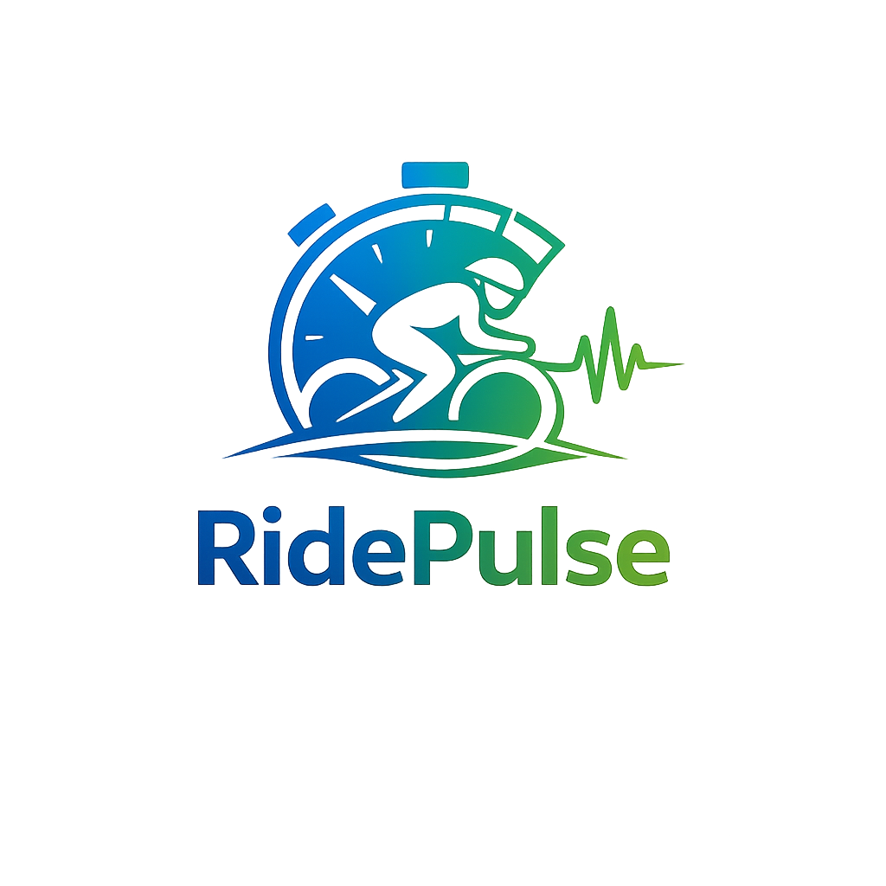

# RidePulse

**Interval Timer para Ciclismo con Voz (Flutter)**



---

## 🚴 Descripción
RidePulse es una app Flutter multiplataforma para crear, guardar y ejecutar rutinas de intervalos para ciclismo, con avisos de voz en español y diseño moderno.

- Crea y edita planes de intervalos personalizados
- Persistencia local (SQLite en móvil/escritorio, SharedPreferences en web)
- Avisos de voz en español (ajustable, selecciona voz del sistema)
- Animación de progreso con bicicleta
- UI/UX optimizada para uso en ruta
- Soporte multiplataforma: Android, iOS, Web, Windows, macOS, Linux

---

## 📲 Instalación rápida

1. **Clona el repositorio:**
   ```bash
   git clone https://github.com/JuanPabloTorres/cycling-voice-interval-timer.git
   cd cycling-voice-interval-timer/cycling_voice_interval_timer
   ```
2. **Instala dependencias:**
   ```bash
   flutter pub get
   ```
3. **Ejecuta en tu plataforma:**
   ```bash
   flutter run -d chrome      # Web
   flutter run -d android    # Android
   flutter run -d windows    # Windows
   flutter run -d ios        # iOS (requiere Mac)
   flutter run -d macos      # macOS
   ```

---

## ⚙️ Funcionalidades principales

- **Timer de intervalos** con avisos de voz en español
- **Animación de bicicleta** en barra de progreso
- **Persistencia multiplataforma** (SQLite/SharedPreferences)
- **Ajustes de voz:** selecciona voz, velocidad, tono y volumen
- **Modo oscuro** por defecto para visibilidad en exteriores
- **Diseño responsive** y componentes reutilizables

---

## 🗣️ Mejorando la voz en Windows
Para voces más naturales:
1. Ve a **Configuración → Hora e Idioma → Voz → Administrar voces**
2. Instala voces como **"Microsoft Helena"** o **"Microsoft Laura"** (español)
3. Selecciónalas en los ajustes de voz de la app

---

## 🛠️ Estructura del proyecto

```
cycling_voice_interval_timer/
├── lib/
│   ├── data/           # Persistencia y repositorios
│   ├── models/         # Modelos de datos
│   ├── providers/      # State management
│   ├── screens/        # Pantallas principales
│   ├── services/       # Lógica de negocio (TTS, timer)
│   ├── ui/             # Temas y componentes UI
│   └── main.dart       # Entry point
├── assets/icon/        # Íconos de la app
├── android/ ios/ web/ windows/ macos/ linux/  # Plataformas
└── pubspec.yaml
```

---

## 🧑‍💻 Contribuir
- Crea un branch desde `dev`
- Haz tus cambios y PRs hacia `dev`
- Issues y sugerencias bienvenidas

---

## 📄 Licencia
MIT
